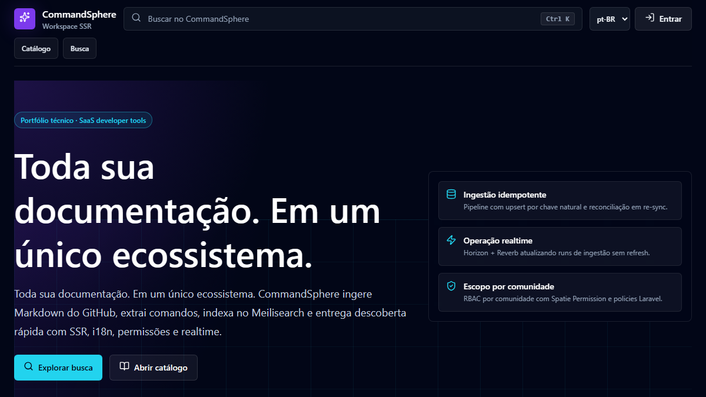
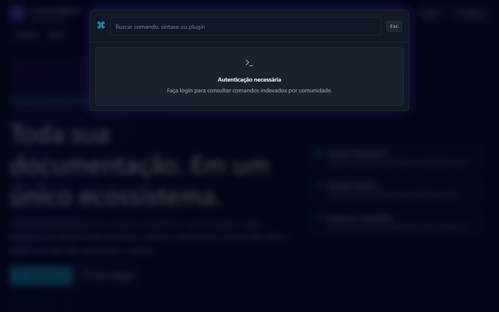
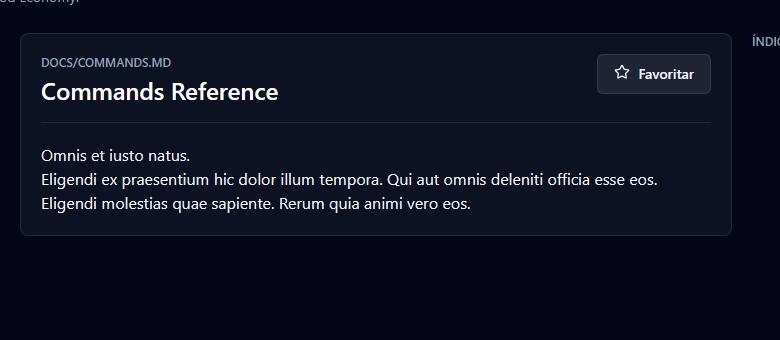
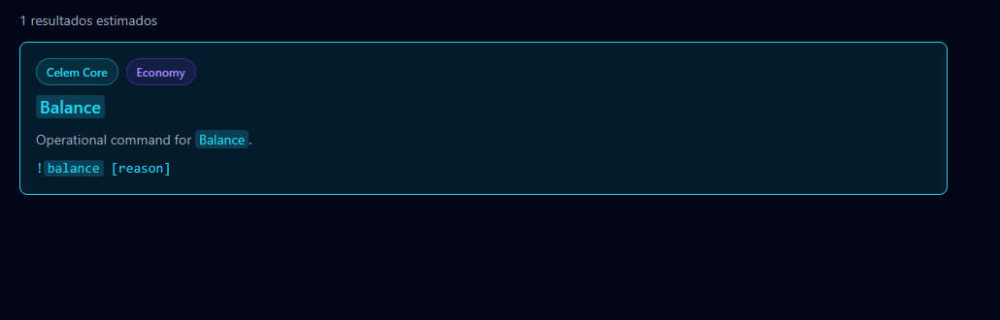
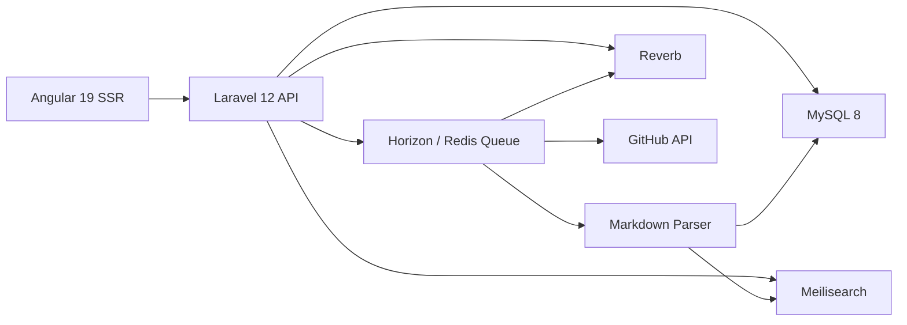
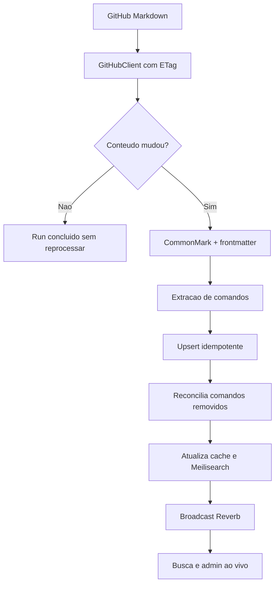

# CommandSphere

> English summary: CommandSphere is a full-stack documentation discovery platform for plugin ecosystems. It ingests Markdown from GitHub, extracts command metadata idempotently, indexes it in Meilisearch, and serves a dark-first Angular SSR experience with Discord/Sanctum auth, scoped permissions, favorites, analytics, realtime ingestion status, and production Docker packaging.

CommandSphere e um hub de documentacao inteligente para ecossistemas de plugins. A proposta e transformar documentacao Markdown dispersa em um catalogo pesquisavel, versionado e operavel, com UX de ferramenta de desenvolvedor e arquitetura SaaS demonstravel.

## Visao

O produto resolve um problema recorrente em ecossistemas de plugins: comandos, guias e changelogs vivem em repositorios separados, com convencoes inconsistentes e descoberta ruim. O CommandSphere centraliza esses materiais por comunidade, plugin e versao, mantendo a origem no GitHub e automatizando ingestao, busca, favoritos, analytics e status em tempo real.

## Screenshots









## Arquitetura



## Pipeline de Ingestao



Pontos tecnicos relevantes:

- Idempotencia por chaves naturais: `commands(plugin_version_id, slug)` e `documents(plugin_version_id, path)`.
- Re-sync remove comandos que sumiram da documentacao, sem duplicar dados existentes.
- Documentos fora da convencao sao ingeridos com warning, nunca descartados silenciosamente.
- ETag evita reprocessamento e reduz pressao no rate limit do GitHub.
- Cache Redis de leitura e indice Meilisearch sao invalidados/atualizados ao final da ingestao.

## Stack Justificada

| Camada | Tecnologia | Motivo |
|---|---|---|
| Backend | Laravel 12, PHP 8.3 | API produtiva, filas, policies, scheduler e ecossistema maduro |
| Auth | Discord OAuth2, Sanctum | Fluxo realista para comunidades tecnicas e bearer simples para SPA |
| Dominio | MySQL 8 | Relacionamentos fortes, unicidade natural e queries analiticas |
| Busca | Scout + Meilisearch | Typo tolerance, facets e resposta rapida para busca em tempo real |
| Filas/cache | Redis + Horizon | Ingestao assinc, cache de catalogo e observabilidade de jobs |
| Realtime | Reverb + Echo | Status de ingestao ao vivo em canais privados por comunidade |
| Frontend | Angular 19 standalone + SSR | UX indexavel, rotas lazy, signals e shell dark-first |
| i18n | Transloco | pt-BR default, en secundario, SSR-aware |
| Qualidade | Pest, Jest, Playwright, Pint, Lighthouse | Cobertura critica, E2E real e avaliacao de SEO/performance |

## Decisoes e Trade-offs

As ADRs estao em `docs/DECISIONS.md`. Resumo das decisoes principais:

- Monorepo Dockerizado: simplifica avaliacao e setup local, com custo de builds maiores.
- SSR Angular: melhora SEO e primeira renderizacao publica, exigindo disciplina para nao vazar estado entre requests.
- Token em memoria: reduz persistencia de segredo no browser, com trade-off de login menos persistente.
- Busca por Meilisearch: entrega facets/typo tolerance sem varrer MySQL, com custo operacional de manter indice.
- Markdown custom renderer: controla XSS e UX do doc viewer, mantendo escopo menor que um renderer universal.
- Realtime privado por comunidade: evita vazamento de status operacional, com custo de Reverb/Horizon em runtime.
- Public discovery read model: paginas de catalogo, plugin, documento, comando e busca sao indexaveis; acoes mutantes e dados operacionais continuam autenticados e escopados.

## Setup Local em 1 Comando

```bash
cp .env.example .env && docker compose up --build
```

Depois que os containers subirem:

```bash
docker compose exec -T backend php artisan migrate:fresh --seed
docker compose exec -T backend php artisan scout:sync-index-settings
docker compose exec -T backend php artisan scout:import "App\Models\Command"
```

Servicos locais:

| Servico | URL |
|---|---|
| Frontend SSR | http://localhost:4200 |
| Backend API | http://localhost:8000/api/v1 |
| Reverb | http://localhost:8080 |
| Meilisearch | http://localhost:7700 |
| MySQL | localhost:3306 |
| Redis | localhost:6379 |

Usuarios seed:

| Email | Papel | Senha |
|---|---|---|
| admin@demo | community-admin | password |
| maintainer@demo | maintainer | password |
| member@demo | member | password |

## Qualidade

Backend:

```bash
docker compose exec -T backend ./vendor/bin/pest
docker compose exec -T -e XDEBUG_MODE=coverage backend ./vendor/bin/pest --coverage --min=0
docker compose exec -T backend ./vendor/bin/pint --test
docker compose exec -T backend composer audit
```

Frontend:

```bash
cd frontend
npx tsc --noEmit
npm run lint
npm test -- --runInBand --coverage
npm run build
npm run e2e
npm audit --audit-level=critical
```

Cobertura critica atual:

| Area | Evidencia |
|---|---|
| Parser / ingestao | `IngestionService` 93.3%, `MarkdownParser` 86.2% |
| Busca / facets | `SearchController` 95.7%, `DiscoveryApiTest` cobre facets, filtros e isolamento |
| Permissoes por comunidade | `CommunityPermissionScopeTest`, policies e testes 401/403 |
| Frontend | Jest 71.39% statements, Playwright cobre login dev, busca, doc/command e favorito |

## SEO e SSR

Paginas publicas sao renderizadas no servidor e indexaveis:

- `/`
- `/search`
- `/c/:community`
- `/c/:community/p/:plugin`
- `/commands/:slug`

O frontend gera meta tags dinamicas, Open Graph, canonical link e JSON-LD para landing, plugin e comando. `robots.txt` e `sitemap.xml` ficam em `frontend/public`.

## Hardening

- Markdown sanitizado antes de `SafeHtml`.
- Webhook GitHub validado por HMAC SHA-256.
- Rate limiting em busca, sync e webhooks.
- Headers de seguranca no Laravel e no servidor SSR Node.
- Sem `localStorage`/`sessionStorage` para token Sanctum.
- Sem secrets hardcoded; `.env.example` documenta variaveis.
- i18n pt-BR/en com paridade de chaves.

## Docker de Producao

O compose de producao empacota:

- PHP-FPM Laravel multi-stage
- Nginx para API
- Node SSR Angular multi-stage
- MySQL, Redis, Meilisearch, Horizon e Reverb

Exemplo local:

```bash
docker compose -f docker-compose.prod.yml up -d --build
docker compose -f docker-compose.prod.yml exec -T backend php artisan migrate --force
docker compose -f docker-compose.prod.yml exec -T backend php artisan scout:sync-index-settings
docker compose -f docker-compose.prod.yml exec -T backend php artisan scout:import "App\Models\Command"
```

Variaveis obrigatorias de producao ficam documentadas em `.env.example`: `APP_KEY`, `APP_URL`, `DB_*`, `MEILISEARCH_MASTER_KEY`, `GITHUB_TOKEN`, `GITHUB_WEBHOOK_SECRET`, `DISCORD_*`, `REVERB_*`.

Variaveis publicas do frontend SSR:

| Variavel | Uso |
|---|---|
| `COMMANDSPHERE_PUBLIC_ORIGIN` | Origem publica usada por canonical URLs, JSON-LD e runtime config |
| `COMMANDSPHERE_API_PUBLIC_URL` | URL publica consumida pelo browser para `/api/v1` |
| `COMMANDSPHERE_ALLOWED_HOSTS` | Hosts aceitos pelo servidor SSR, separados por virgula |
| `COMMANDSPHERE_REVERB_PUBLIC_HOST` | Host publico do websocket Reverb |
| `COMMANDSPHERE_REVERB_PUBLIC_PORT` | Porta publica do websocket Reverb |
| `COMMANDSPHERE_REVERB_PUBLIC_SCHEME` | `http` ou `https` para o websocket publico |

## Estrutura

```text
backend/   Laravel API, dominio, ingestion jobs, policies, scheduler, Reverb
frontend/  Angular SSR standalone, design system, i18n, domain screens, E2E
docker/    Dockerfiles dev/prod e Nginx
docs/      Visao, ADRs, progresso e acoes humanas
```

## Status

CommandSphere v1 cobre fundacao, dominio, auth, ingestao, discovery API, telas SSR, realtime, automacao, SEO, hardening, E2E e Docker de producao. O progresso faseado esta em `docs/PROGRESS.md`.
